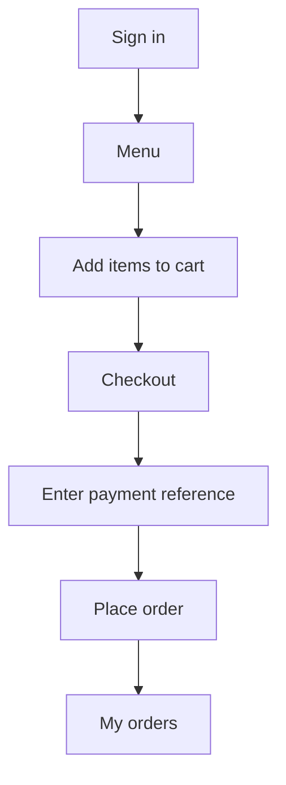

# zorder User Journey

## Surfaces

The MVP is a web app with two roles:

- `/admin` — merchant setup and operations.
- `/user` — customer ordering after sign-in.

Both surfaces use username + 6-digit PIN auth for the demo. Signup creates role `user` only.

## Merchant Journey (`/admin`)

The merchant configures the shop before customers can order.

| Tab | Purpose |
| --- | --- |
| Orders | Review all incoming orders and payment status |
| Order Rules | Generate and publish deterministic JSON workflows |
| Inventory | Maintain the product catalog shown on the customer menu |
| Branding | Storefront name, tagline, description, and payment instructions |

### Setup sequence

1. Add products in **Inventory → Products** (name, category, price, active flag).
2. Generate workflow rules in **Order Rules** from business context.
3. Publish the workflow from **Live Draft**.
4. Save **Branding**, including PayNow / bank transfer instructions.

Published products feed `GET /menu`. Published branding feeds the `/user` landing page and checkout copy.

## Customer Journey (`/user`)

Everything before login stays on the branded landing page. After login, the customer flow is:

### Customer tabs (post-login)

| Tab | Action |
| --- | --- |
| Menu | Browse products and add items to cart |
| Checkout | Review cart, enter payment details, and place order |
| My orders | See only orders placed by the signed-in customer |
| Profile | Save name, email, contact details, and change PIN |

The workspace header shows **Welcome back, {name}** using the saved profile name, falling back to the username when profile details are empty.

### API contract

| Endpoint | Role | Notes |
| --- | --- | --- |
| `GET /menu` | user | Active products from merchant inventory |
| `POST /orders/place` | user | Structured cart placement |
| `GET /orders` | user | Scoped to `placed_by_username` |
| `GET /orders` | admin | All orders |
| `GET /config/shop` | public | Branding + payment instructions |
| `POST /workflows/publish` | admin | Activates generated workflow JSON |

### Payment rules

- Accepted methods: PayNow and bank transfer (configured in branding copy).
- Orders save immediately with status `paid`, `unpaid`, or `unknown` based on the payment reference text.
- Merchant sees the same orders in **Admin → Orders** and sales analytics under **Inventory**.

## Critical UX Rules

- Customer menu only shows **active** products from merchant inventory.
- Customer order history is **scoped to the signed-in username**.
- Merchant workflow JSON remains deterministic; customer placement still runs through the same runner for auditability.
- Do not expose admin inventory editing or workflow builder on the customer side.

## Future

Telegram and other channels can reuse the same workflow runner and product catalog. The customer web flow is the reference implementation for structured ordering.
