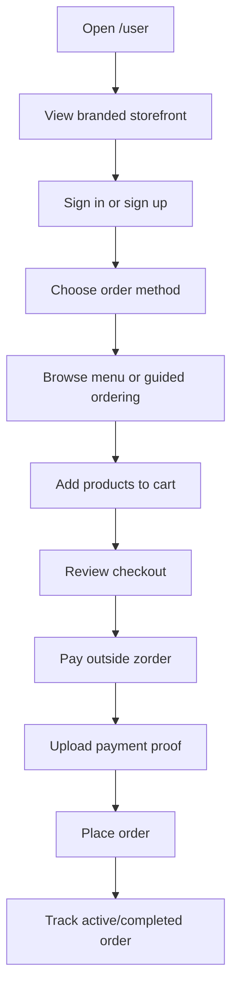
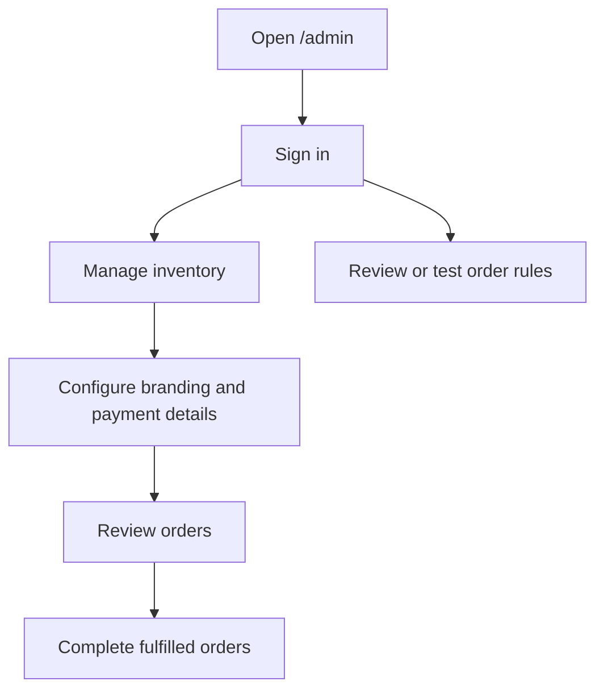

# User Journey

zorder has two working app surfaces:

- `/user` for customers
- `/admin` for merchants/admins

Both use username + 6-digit PIN auth in the MVP. Public visitors can also view `/intro`, `/tech-stack`, and `/why-zo-computer`.

## Customer Journey

### Customer Pages

| Area | Current Behavior |
| --- | --- |
| Storefront landing | Uses merchant branding, tagline, description, payment methods, and menu preview. |
| Login/signup | Username + 6-digit PIN. Signup creates a customer user only. |
| Menu | Shows active products grouped by category. |
| Guided order | Chatbot-style UI that guides product, quantity, payment, and completion. |
| Checkout | Shows cart, notes, payment instructions, payment proof upload, and place order button. |
| My orders | Splits active orders and history. |
| Profile | Saves required profile fields and lets non-demo users change PIN. |

### Payment Rule

Structured checkout requires an uploaded payment proof image before `/orders/place` accepts the order.

zorder does not verify payment through a bank or gateway. It stores the proof for merchant review and marks the structured checkout order as paid when valid proof is uploaded.

## Merchant Journey

### Admin Tabs

| Tab | Current Behavior |
| --- | --- |
| Orders | Shows all orders, payment status, proof, fulfillment state, and PDF download. |
| Order Rules | Shows deterministic customer order flow and workflow tooling. |
| Inventory | Adds/edits/deletes products, uploads product images, bulk imports CSV/JSON, and shows analytics. |
| Branding | Saves storefront copy, PayNow details, generated/uploaded QR, bank details, and footer note. |

## Current API Contracts

| Flow | Endpoint |
| --- | --- |
| Public shop config | `GET /config/shop` |
| Public menu preview | `GET /menu/preview` |
| Customer menu | `GET /menu` |
| Structured checkout | `POST /orders/place` |
| Customer/admin order list | `GET /orders` |
| Complete order | `PATCH /orders/:orderId/complete` |
| Inventory snapshot | `GET /inventory` |
| Branding save | `PUT /config/shop` |
| Workflow test | `POST /workflows/run` |
| Workflow generate | `POST /workflows/generate` |
| Workflow publish | `POST /workflows/publish` |

## Critical UX Rules

- Customer menu must only show active products.
- Customer order history must be scoped to the signed-in username.
- Payment proof must be visible to the merchant.
- Admin tools must not appear in the customer surface.
- Workflow testing can explain rule behavior, but normal structured checkout should remain simple.
