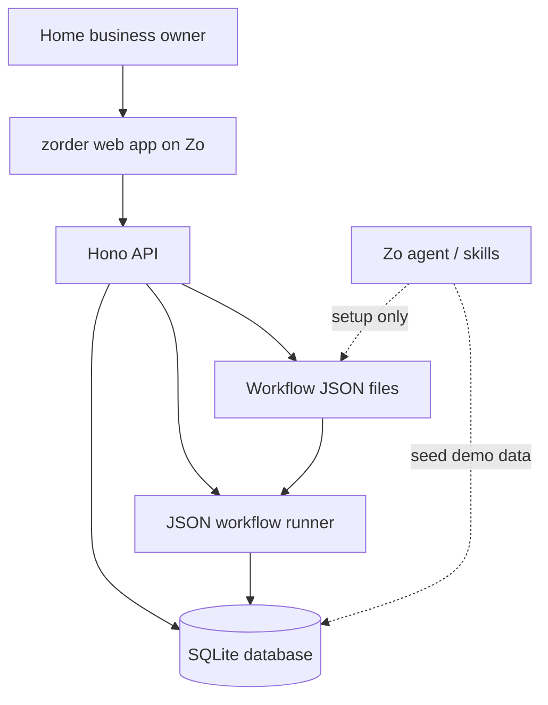
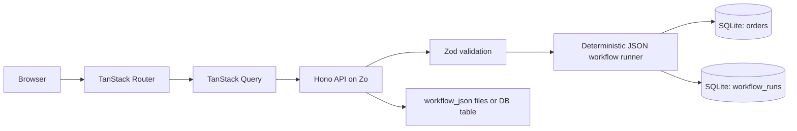
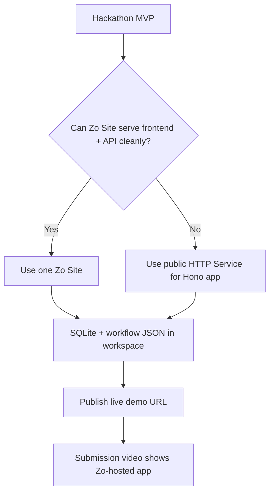
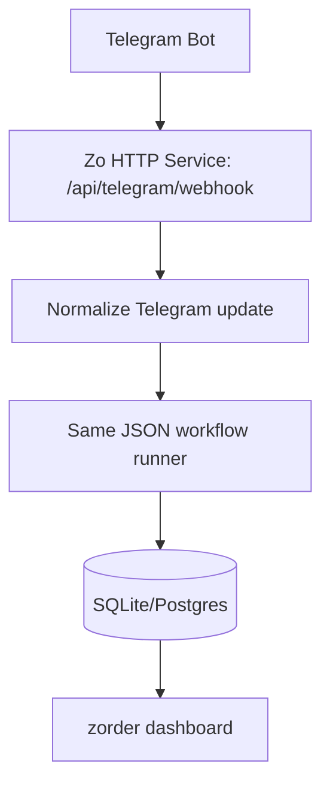

# zorder Zo Infrastructure

## Objective

Use Zo as more than a place to deploy code.

For the Zo Build Challenge, zorder should show that Zo is:

- the live demo host
- the owner-controlled data home
- the build-time AI assistant environment
- the future automation runtime

Runtime order tracking remains deterministic. Zo-assisted AI is used only to speed up building, setup, testing, and demo preparation.

## Recommended MVP Infra



## Zo Hosting Choice

| Need | Zo Feature | How zorder uses it |
| --- | --- | --- |
| Public demo app | Zo Site or public HTTP Service | Host the zorder web app and API for submission. |
| App data | Workspace files + SQLite | Keep the SQLite DB and workflow JSON inside the Zo environment. |
| Custom backend runtime | Zo Service | Run Hono API if the app needs a long-running custom server. |
| Background jobs later | Zo process Service or Automation | Run exports, backups, reminders, or future Telegram bot tasks. |
| Build-time acceleration | Zo agent / skills | Generate workflow JSON, seed data, write test cases, and prepare demo material. |

## Deployment Shape

For the hackathon MVP, prefer one deployable app:

```text
zorder app
- Vite React frontend
- TanStack Router
- TanStack Query
- Hono API
- SQLite database file
- JSON workflow files
```

If Zo Site supports the needed app shape cleanly, use a Zo Site. Zo docs describe Sites as full website projects hosted on the user's Zo server, with access to workspace files and SQLite as a default database option.

If we need more runtime control, register a Zo HTTP Service. Zo docs describe Services as long-running programs for custom servers, databases, bots, sync loops, and background processes.

## Runtime Architecture



## File And Data Layout

Recommended structure once implementation starts:

```text
apps/web
- src/routes
- src/components
- src/lib/api

apps/api
- src/routes/orders.ts
- src/workflows/runner.ts
- src/workflows/schema.ts
- src/db/schema.ts
- src/db/client.ts

data
- zorder.sqlite

workflows
- default-order-flow.json
- sample-home-bakery-flow.json
```

For the demo, SQLite is enough because:

- the product is single-owner first
- the dashboard needs simple order/payment state
- SQLite is easy to inspect and explain
- Zo Sites documentation points to SQLite as the default database choice for sites

## Environment Variables

```text
NODE_ENV=production
PORT=<injected by Zo service>
DATABASE_URL=file:./data/zorder.sqlite
ACTIVE_WORKFLOW_ID=default-order-flow
ZORDER_USER_USERNAME=<set demo user username>
ZORDER_USER_PIN=<set 6-digit user PIN>
ZORDER_ADMIN_USERNAME=<set demo admin username>
ZORDER_ADMIN_PIN=<set 6-digit admin PIN>
AI_SETUP_ENABLED=false
GPT_API_KEY=<optional, setup only>
TELEGRAM_BOT_TOKEN=<future only>
TELEGRAM_WEBHOOK_SECRET=<future only>
```

Rules:

- `ZORDER_USER_USERNAME` and `ZORDER_USER_PIN` protect the `/user` surface and daily order-processing API calls.
- `ZORDER_ADMIN_USERNAME` and `ZORDER_ADMIN_PIN` protect the `/admin` surface and workflow setup APIs.
- `AI_SETUP_ENABLED` should default to `false`.
- Runtime order processing must not require an AI key.
- Telegram variables are reserved for the future integration path.

## Zo Services Plan



Future services:

| Service | Mode | When Needed |
| --- | --- | --- |
| `zorder-web` | HTTP | Public web app and API. |
| `zorder-worker` | Process | Backups, exports, scheduled cleanup. |
| `zorder-telegram` | HTTP or Process | Telegram webhook or polling bot later. |

## Future Telegram Infra

Telegram is not part of the MVP, but the infra should leave a clear path.



Design rule:

- Telegram should only become a new input source.
- It must not fork the order processing logic.
- It should reuse the same JSON workflow runner and order database.

## Build-Time Use Of Zo AI

Use Zo AI where it compounds execution speed:

- generate starter workflow JSON from sample business rules
- create demo data for a home bakery or preorder seller
- draft validation test cases
- summarize workflow behavior for the pitch deck
- help prepare the 60-second submission video script

Do not use Zo AI for:

- classifying every order at runtime
- deciding payment evidence without deterministic rules
- silently changing workflows without owner review

## Demo Story

```text
zorder is hosted on Zo.
The owner's orders, SQLite database, and workflow JSON live in their Zo environment.
Zo AI helps generate and test the workflow during setup.
Daily order tracking runs through deterministic JSON rules, so it stays cheap and predictable.
Telegram can later plug into the same workflow engine as an automation source.
```

## Operational Checklist

- Live URL works on Zo.
- Dashboard loads without local-only dependencies.
- SQLite database is stored in the Zo workspace.
- Workflow JSON can be opened and explained.
- `/orders/process` works without an AI API key.
- Demo data is seeded.
- Submission video shows the Zo-hosted URL.
- Future Telegram path is explained but not overbuilt.

## References

- Zo Computer: https://www.zo.computer/
- Zo Hosting Options: https://zocomputer.mintlify.app/hosting
- Zo Sites: https://zocomputer.mintlify.app/sites
- Zo Services: https://zocomputer.mintlify.app/services
- Zo Automations: https://zocomputer.mintlify.app/automations
- Zo Subscription and Hosted Services: https://zocomputer.mintlify.app/billing
